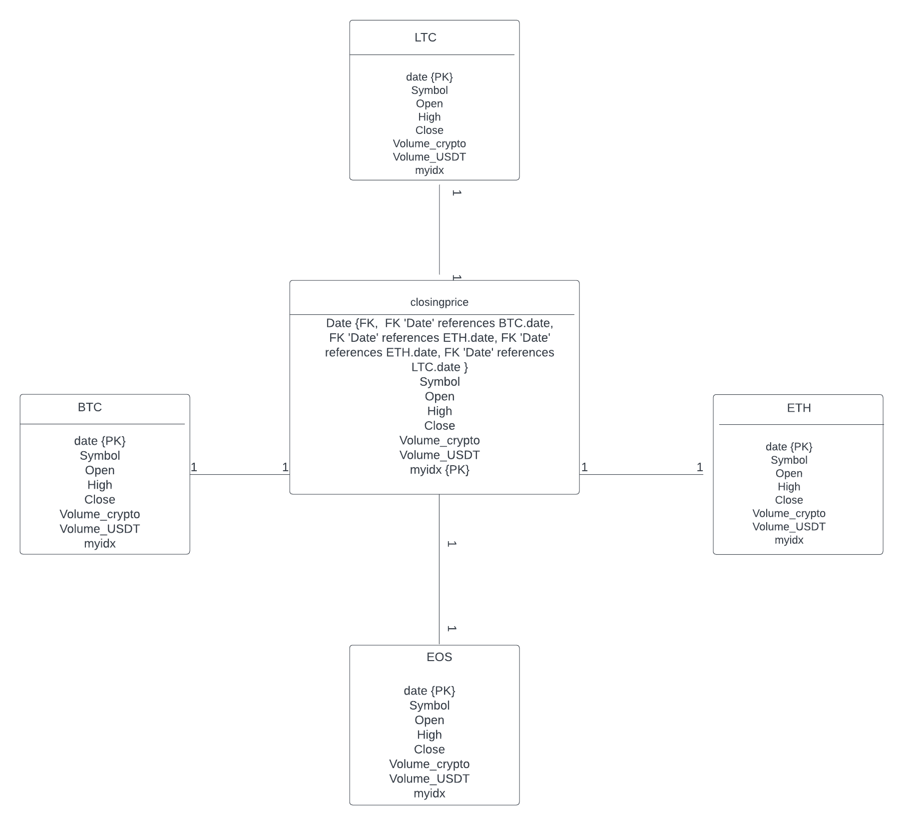

<!DOCTYPE html>
<html lang="en">
<head>
    <meta charset="UTF-8">
</head>
<body>
    <h1>Overview</h1>
    

     
 This is a series of Python and SQL scripts that allows you to design databases for storing, processing, and analyzing pricing data. Data is sourced from this link.:<a href="https://www.cryptodatadownload.com/data/binance/">Click here</a>

    <h2>Getting started</h2>
    Before using the scripts App make sure you have Python3 installed on your computer.
    csv files (pricing data ) are downloaded through web scraping, after which they are cleaned using 
    using pandas. Data are going to be distributed across several databases.
         For example, we create a database with only BTC pricing data, EOS pricing data, ETH pricing data, and LTC pricing data.

   <h3>How to run it?</h3>
   <ul>
     <li>Clone the repository from GitHub: git clone https://github.com/gianniprocida/</li>
     <li>Navigate to the habit-tracker directory: cd habit-tracker</li>
     <li>Run the python script to create the database with pricing data of BTC,ETH, EOS, LTC: python3.8 Load2mysql</li>
     <li>Run the script 'createClosingPrice.sql' to create a new table named "closingprice" in the database, and establish relationships between the "closingprice" table
         and all existing tables in the database as necessary.</li>
   </ul>     

</body>

<h2>Thought Process and Development of the database</h2>
Formally, a habit is can be defined as task that must be completed periodically 
(e.g., brush your teeth every day or go to the dentist once every year). 
The obvious object, therefore, is the Habit
object; less obvious one is 
This UML diagram provides a visual representation of the one-to-one relationships between the closingprice table the BTC, ETH, LTC and EOS tables.
A 1:1 relationship means that each row in one table is associated with one and only one row in another table. 
In other words, there is a one-to-one correspondence between rows in the two tables. 