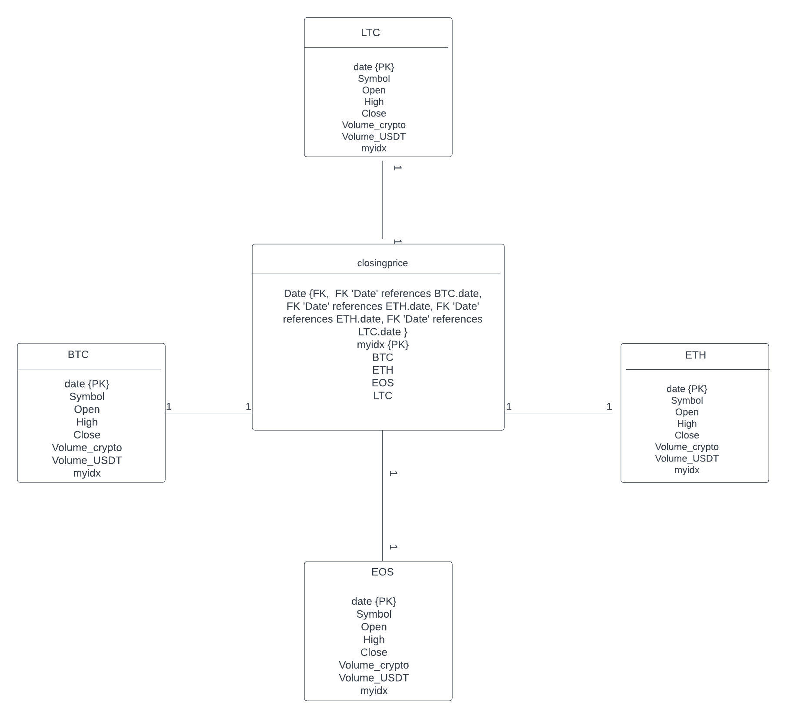

<!DOCTYPE html>
<html lang="en">
<head>
    <meta charset="UTF-8">
</head>
<body>
    <h1>Overview</h1>
    

     
 This is a series of Python and SQL scripts that allows you to design databases for storing, processing, and analyzing pricing data. Data is sourced from this link:<a href="https://www.cryptodatadownload.com/data/binance/">Click here</a>

    <h2>Getting started</h2>

   <h3>How to run it?</h3>
   <ul>
     <li>Clone the repository from GitHub: git clone https://github.com/gianniprocida/pricingDataBinance/tree/new_branch</li>
     <li>Navigate to the pricingDataBinance: cd pricingDataBinance</li>
     <li>Run the python script to create the database with pricing data of BTC,ETH, EOS, LTC: python3.8 Load2mysql.py
 </li>
     <li>Run the script 'createClosingPrice.sql' to create a new table named "closingprice" in the database, and establish relationships between the "closingprice" table
         and all existing tables in the database as necessary.</li>
   </ul>     

</body>

<h2>Thought Process and Development of the database</h2>
This UML diagram provides a visual representation of the one-to-one relationships between the closingprice table the BTC, ETH, LTC and EOS tables.
A 1:1 relationship means that each row in one table is associated with one and only one row in another table. 
In other words, there is a one-to-one correspondence between rows in the two tables. 
In the closing price diagram, the attributes BTC, ETH, EOS, and LTC represent the closing prices of the BTC, ETH, EOS, and LTC tables respectively.

<h2>Analysis using pandas</h2>
A correlation coefficient of around 0.90 between the BTC and ETH columns, after calculating the daily percentage change for the dataset, indicates a strong positive correlation between these two variables. This suggests that there is a high probability that the returns on these two cryptocurrencies will move in the same direction.  

The box plot analysis reveals that the BTC column is less volatile than the other columns in the dataset, as evidenced by the narrow interquartile range (IQR). On the other hand, the EOS column exhibits a large number of outliers, which are data points that lie outside the whiskers of the box plot. This suggests that the EOS column has a higher degree of variability and potentially greater risk associated with it. 